# portTrack — Architecture

**Companion to:** [`implementation_plan_portrack.md`](./implementation_plan_portrack.md) · [`Global_Portfolio_Tracker_PRD.md`](./Global_Portfolio_Tracker_PRD.md)
**Version:** 1.1 (containerized) · **Date:** 2026-08-02

---

## 1. Architectural Style and Why

**Hexagonal (ports & adapters) domain core, deployed as a two-container stack.**

| Force (from the PRD) | Architectural response |
|---|---|
| Tax/FX correctness is the product; a wrong number is a filing defect | Domain packages are **pure functions over immutable data** — no I/O, no ambient clock. Every tax rule is unit-testable in isolation with a fixed `Clock`. |
| PII must never leave the device unmasked (FR-7) | Masking lives in the **browser bundle** (ADR-013). The API holds only a *verifier* that fails closed. There is exactly one egress choke point. |
| Data sovereignty, local-first (§4.3) | Single-tenant encrypted SQLite on the **host's own disk** via bind mount (ADR-012), page-level AES-256 (ADR-015). No cloud dependency, no telemetry. |
| Must run anywhere, no toolchain (FR-8.1) | Two Docker images + one compose file. The domain never knows it is containerized. |
| Compliance artifacts must be reproducible | Snapshots are **immutable and content-addressed** (ADR-006). Rules are **versioned data** keyed by FY (ADR-005). |
| <1.5 s valuation over 1,000+ lots (NFR-2) | The whole domain runs **in one process** — valuation is in-memory function composition, not a service mesh. The container split is UI/API only; the domain is never distributed. |

**What this deliberately is not:** microservices. Splitting the tax engine from the ledger would put a
network hop inside a calculation that must finish in 1.5 s, and would make a tax computation non-atomic
with respect to the ledger it read. One process, many pure modules.

---

## 2. C4 Level 1 — System Context

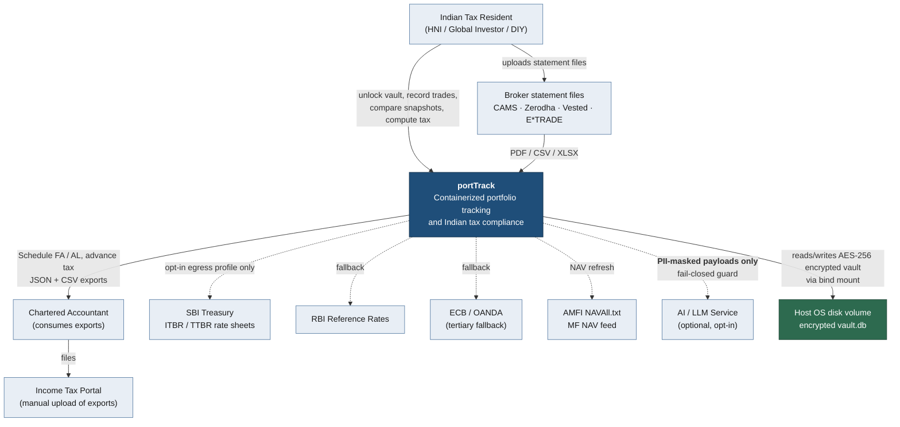

**Dotted edges are default-deny.** Every dotted line requires the user to start the `egress` compose
profile *and* trigger the action explicitly (ADR-010). A default `docker compose up` makes zero
outbound connections.

---

## 3. C4 Level 2 — Container View (deployment reality)

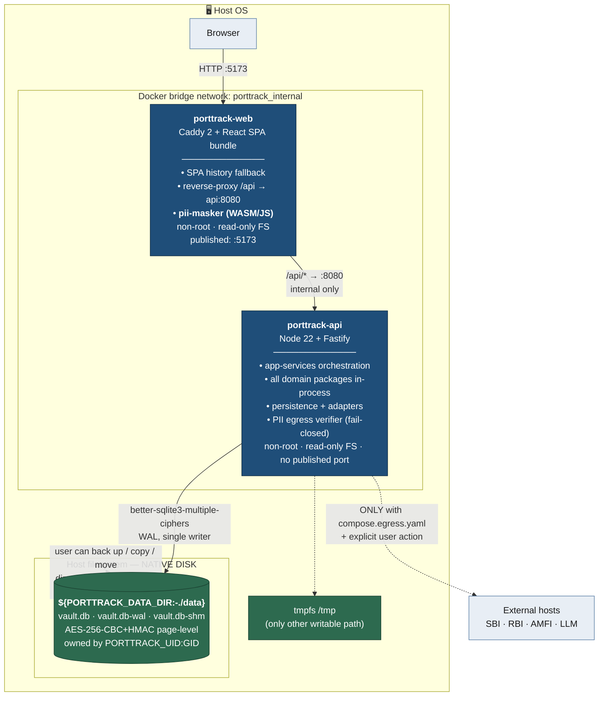

### Why bind mount, not a Docker volume

PRD FR-8.2 requires the DB on the "native OS disk volume". A **named volume** lives under
`/var/lib/docker/volumes/…`, is owned by root, is opaque to the user's backup tooling, and disappears on
`docker volume prune`. A **bind mount** puts `vault.db` at a path the user chose, owned by the user's own
UID, backed up by whatever already backs up their home directory. That is the requirement. (ADR-012)

| Property | Bind mount ✅ | Named volume ❌ |
|---|---|---|
| Visible on host at a user-chosen path | Yes | No (docker-internal path) |
| Survives `docker volume prune` | Yes | No |
| Backup with normal host tools | Yes | Requires a helper container |
| Owned by the host user | Yes (via UID/GID mapping) | Root by default |

---

## 4. C4 Level 3 — Component View

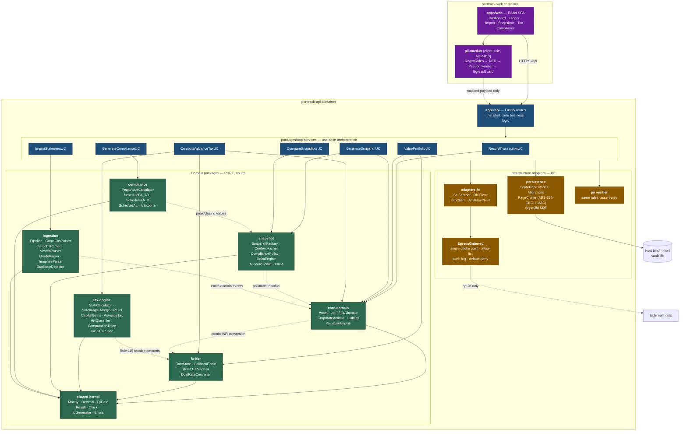

**Colour legend:** 🟩 green = pure domain (no I/O, deterministic) · 🟦 blue = orchestration · 🟧 amber =
I/O adapters · 🟪 purple = browser-side. **Arrows only ever point right/down this list.** A green node
importing an amber node is a lint failure.

### Component responsibilities

| Component | Owns | Explicitly does NOT own |
|---|---|---|
| `shared-kernel` | `Money`, `Decimal`, `FyDate`, `Result<T,E>`, `Clock`/`IdGenerator` ports, error taxonomy | Any business rule |
| `core-domain` | Asset/lot lifecycle, FIFO allocation, corporate actions, liabilities, valuation | FX rate selection, tax classification |
| `fx-itbr` | Rate storage + provenance, fallback chain, Rule 115, dual-rate conversion | Fetching rates (that's `adapters-fx`) |
| `tax-engine` | Slabs, surcharge, marginal relief, cess, CG classification & computation, advance tax, HNI flag, trace | Where income came from |
| `snapshot` | Immutability, content hashing, compliance date policy, delta/variance, XIRR | Valuing positions (delegates to `core-domain`) |
| `ingestion` | Parse → validate → stage → reconcile → commit, per-broker parsers, dedup | Persisting (returns commands to `app-services`) |
| `compliance` | Peak value, Schedule FA A3/D, Schedule AL, ITR export shapes | Deciding HNI status (asks `tax-engine`) |
| `pii-masker` | Regex + NER masking, pseudonymisation, fail-closed guard | Talking to any AI service |
| `persistence` | SQLite repositories, migrations, page-level AES-256 cipher, Argon2id KDF | Domain rules |
| `EgressGateway` | The *only* outbound socket in the process; allow-list + audit | Deciding what to send |

---

## 5. Data Flow Sequences

### 5.1 Foreign equity partial exit — the dual-rate flow (US-1.4, US-2.5 · PRD FR-1/FR-2)

The single most consequential flow in the system: it is where ADR-003 resolves the PRD's rate conflict.

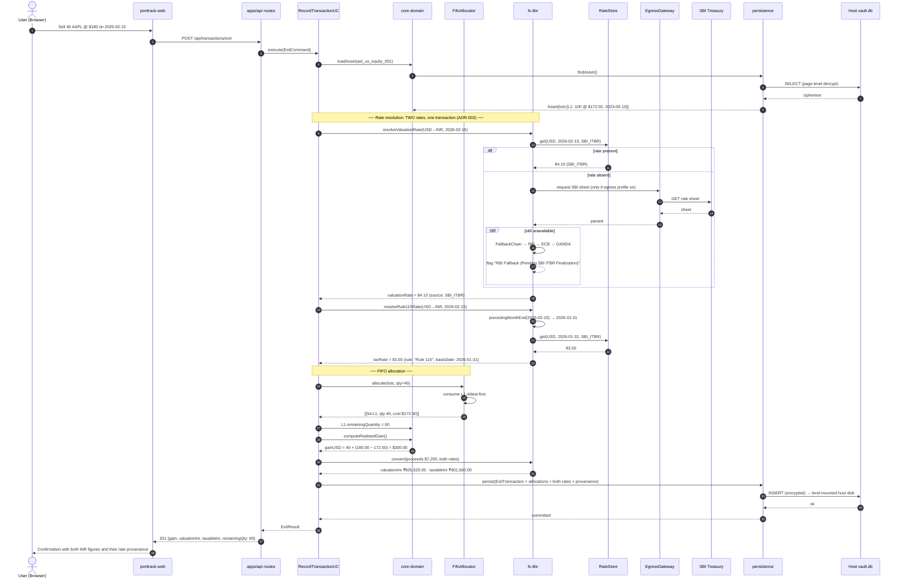

> **The invariant this diagram exists to protect:** `valuationInr` (₹605,520) is what the dashboard shows;
> `taxableInr` (₹601,560) is what the capital gains engine reads. They differ by ₹3,960. Collapsing them
> into one number satisfies one PRD clause and violates the other.

---

### 5.2 Dual compliance snapshot generation (US-3.2/3.3 · PRD FR-3)

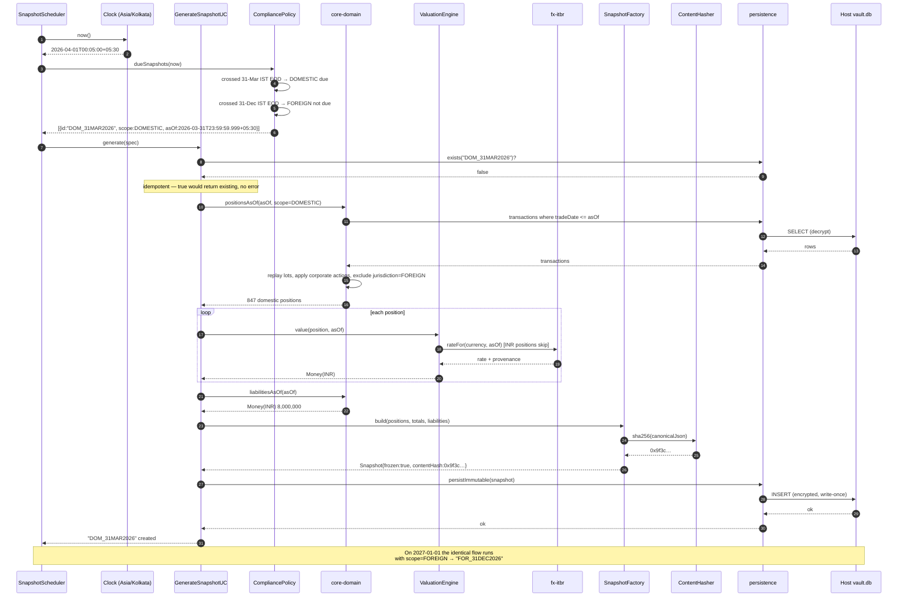

---

### 5.3 Advance tax Q3 with realised capital gains (US-5.10 · PRD FR-5)

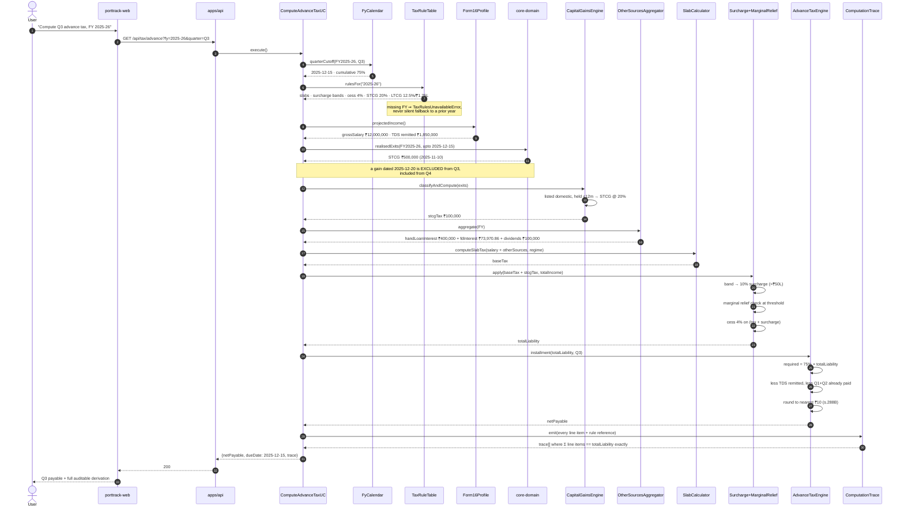

---

### 5.4 PII masking before AI egress — fail-closed (US-7.3/7.4 · PRD FR-7)

The masker runs **in the browser**, before the payload ever reaches the API container (ADR-013).

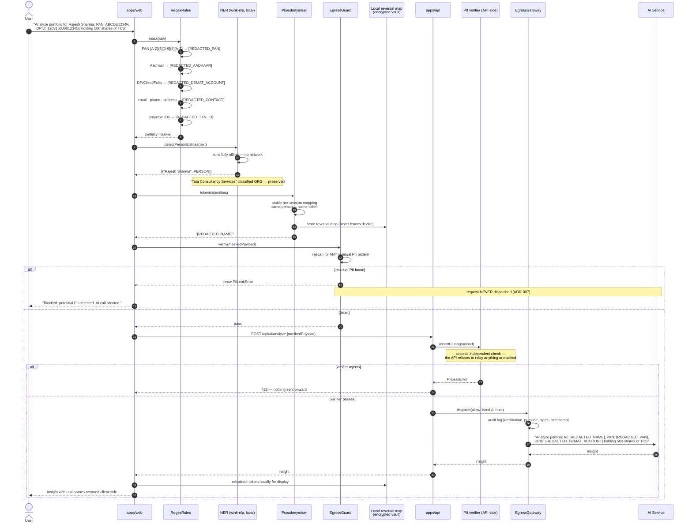

> **Two independent guards, both fail-closed.** The browser guard is the requirement; the API verifier
> exists because a bug in the SPA must not be sufficient to leak PII. Neither guard warns-and-continues.

---

### 5.5 CAMS CAS PDF ingestion — password never persisted (US-4.2 · PRD FR-4/NFR-1)

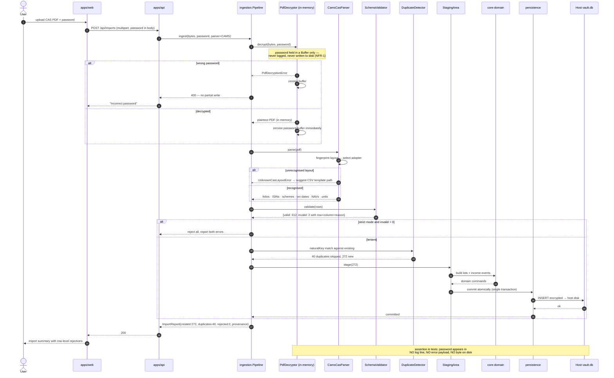

---

### 5.6 Snapshot comparison — live vs historical (US-3.5/3.6 · PRD FR-3)

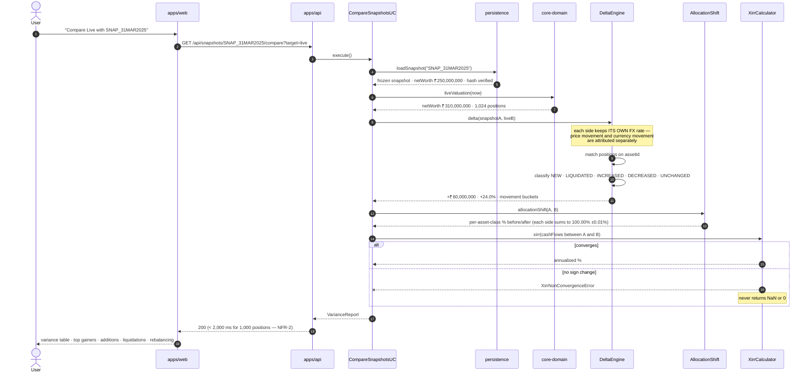

---

### 5.7 Container startup and host-disk binding (US-9.3/9.4/9.5 · PRD FR-8)

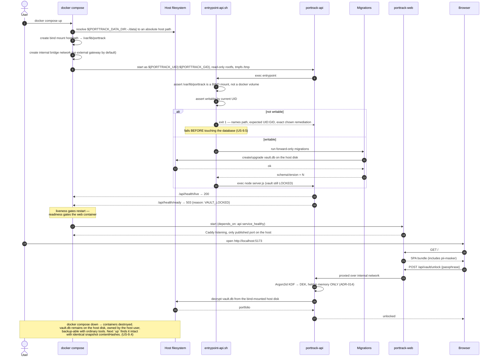

---

## 6. Cross-Cutting Concerns

### 6.1 Trust and data-classification boundaries

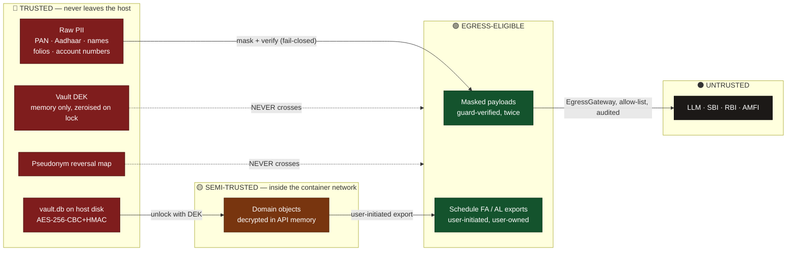

### 6.2 Error taxonomy

| Kind | Mechanism | Examples |
|---|---|---|
| **Expected domain failure** | `Result<T, DomainError>` — caller must handle | `InsufficientQuantityError`, `RateUnavailableError`, `TemplateHeaderMismatchError` |
| **Programmer error** | `throw` typed error, crash the request | `CurrencyMismatchError`, `SnapshotImmutableError` |
| **Security stop** | `throw`, abort, audit | `PiiLeakError`, `VaultUnlockError` |
| **Infrastructure** | `throw`, retry at the adapter only | `PdfDecryptionError`, bind-mount permission failure |

Absolute rules: no empty `catch`; **no error message or `cause` chain ever carries PII** (asserted by
`expectNoPii()` in the shared test kit); `RateUnavailableError` never degrades to a substituted `1.0`.

### 6.3 Determinism

Every non-deterministic input is a port: `Clock` (fixed in tests), `IdGenerator` (seeded), `Rng`.
Consequences — snapshot `contentHash` is reproducible; tax computations for a past FY yield identical
output forever; the entire test suite is hermetic and needs no network.

### 6.4 Performance strategy vs NFR-2

| Budget | Strategy | Guard |
|---|---|---|
| Valuation < 1.5 s @ 1,000 lots | Whole domain in one process; FX rates batch-loaded into a `Map` keyed `(currency, date)` before the valuation loop — never a lookup per lot | `tests/functional/perf/valuation-budget.bench.ts`, plus in-container run (US-9.7) |
| Snapshot delta < 2.0 s @ 1,000 positions | Position matching via hash join on `assetId`, not nested scan; totals precomputed at freeze time | `budgets.bench.ts` |
| Container overhead | API is a thin HTTP shell; no serialization of domain objects between components | `perf-in-container.spec.ts` |

Budgets are CI-enforced from M2 onward so a regression is attributed to the commit that caused it.

---

## 7. Deployment View

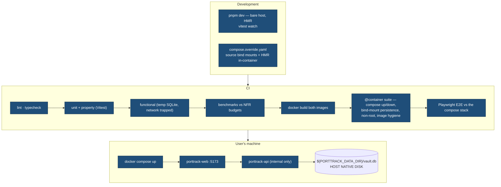

**Runtime configuration** (all via `.env`, none baked into images — FR-8.3):

| Variable | Default | Purpose |
|---|---|---|
| `PORTTRACK_DATA_DIR` | `./data` | **Host** path for the encrypted vault (ADR-012) |
| `PORTTRACK_UID` / `PORTTRACK_GID` | invoking user | Ownership of bind-mounted files (US-9.5) |
| `PORTTRACK_WEB_PORT` | `5173` | Only published host port |
| `PORTTRACK_EGRESS` | `deny` | `allow` requires `compose.egress.yaml` |

The vault passphrase is **not** in this table by design — it is supplied per session through the UI and
never touches the environment, an image layer, or disk (ADR-014).

---

## 8. Architecture Decision Index

Full text and reversibility assessment in [`implementation_plan_portrack.md` §0](./implementation_plan_portrack.md#0-critical-decisions--prd-conflict-resolutions-read-first).

| ADR | Decision | Realised in |
|---|---|---|
| 001 | TypeScript monorepo, pure domain core | §4 component view |
| 002 | All money is `Decimal`/`Money` | `shared-kernel` |
| 003 | **Dual FX rate** — resolves the PRD's FR-1 vs FR-2 conflict | §5.1 |
| 004 | HNI = income > ₹50L **or** net worth > ₹10 Cr | `tax-engine.HniClassifier` |
| 005 | Tax rules are FY-keyed data, never code literals | §5.3 |
| 006 | Snapshots immutable + content-addressed | §5.2 |
| 007 | PII masking fails closed | §5.4 |
| 008 | All EOD boundaries in Asia/Kolkata | §5.2 |
| 009 | Liabilities are first-class | `core-domain.Liability` |
| 010 | Zero egress by default, one gateway | §3, §6.1 |
| 011 | Two containers: `porttrack-web` + `porttrack-api` | §3 |
| 012 | DB on a **host bind mount**, not a Docker volume | §3, §5.7 |
| 013 | PII masking stays in the browser bundle | §5.4 |
| 014 | Passphrase in memory only, never on disk | §5.7 |
| 015 | Vault cipher is page-level AES-256-CBC+HMAC, **not** GCM (NFR-1 amended) | §3, §6.1 |
